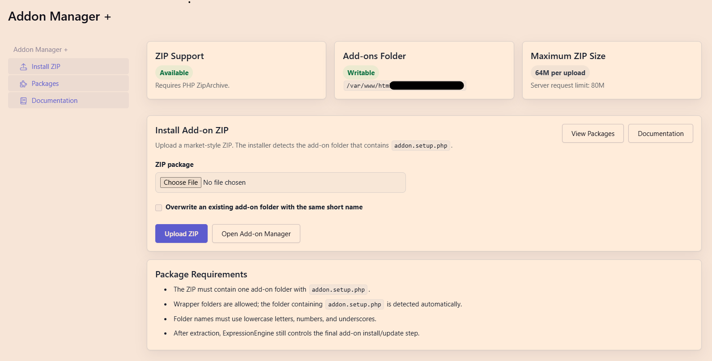

# Addon Manager +

**Install and manage ExpressionEngine add-on ZIP packages directly from the EE 7 control panel.**

Author: Javid Fazaeli  
License: MIT  
Version: 1.1.0

---

## Overview

Addon Manager + is an ExpressionEngine 7 control panel add-on that handles uploading, extracting, and managing third-party add-on ZIP packages — without leaving the EE control panel. Once a package is extracted, it hands install, update, settings, and uninstall actions back to ExpressionEngine's native add-on manager.

## Why This Exists

The standard ExpressionEngine add-on installation workflow involves:

1. Download a ZIP from a third-party source.
2. Unzip it locally.
3. Locate the real add-on folder (sometimes nested inside a wrapper folder).
4. Upload that folder to `system/user/addons/` via FTP or SSH.
5. Return to the ExpressionEngine control panel to complete the install.

Addon Manager + keeps more of this workflow inside the control panel: upload the ZIP, and the add-on detects the real folder, extracts it into the correct location, and presents the install button — all without touching FTP.

## Features

- Upload third-party add-on ZIP packages directly from the control panel.
- Detect the real add-on folder automatically by locating `addon.setup.php`, including inside a wrapper folder.
- Extract packages into the active add-ons directory.
- Display installed / not installed / update available status for each package.
- Link back into ExpressionEngine's native install, update, settings, and uninstall flow.
- Reject unsafe ZIP paths, including absolute paths and `..` path traversal.
- Generate package downloads on demand without permanently storing ZIP files.
- Sort not-installed add-ons before installed ones for quick access.
- Show the Settings action only for add-ons that declare a settings page.
- Includes a bundled control panel documentation page and add-on icon.

## Requirements

- ExpressionEngine 7
- PHP `ZipArchive` extension
- A writable add-ons directory (`system/user/addons/`)
- Control panel access with permission to manage add-ons

## Installation

1. Copy the `addon_installer/` folder into `system/user/addons/`.
2. In ExpressionEngine, open **Developer > Add-Ons**.
3. Find **Addon Manager +** and click **Install**.
4. Open Addon Manager + from the add-on settings page.

## Usage

### Uploading a package

1. Go to **Addon Manager + > Install ZIP**.
2. Select a ZIP file and upload it.
3. On success, click **Install** in the notice, or find the add-on on the Packages screen.

### Packages screen

The Packages screen shows all detected packages as responsive cards with status badges:

| Badge | Meaning |
|-------|---------|
| Installed | The add-on is extracted and installed in ExpressionEngine. |
| Not Installed | The add-on is extracted but not yet installed. |
| Update Available | A newer version was uploaded over an existing installed add-on. |

Available actions per card:

- **Install** — available for not-installed add-ons.
- **Update** — available when a newer version has been uploaded.
- **Settings** — available only when the add-on declares a settings page.
- **Download** — generates a ZIP for any detected add-on on demand.
- **Uninstall** — (red) available for installed add-ons.

## Package Format

The ZIP should contain one add-on folder named with the add-on short name:

```text
my_addon/
  addon.setup.php
  upd.my_addon.php
  mcp.my_addon.php
  ...
```

Wrapper folders are allowed:

```text
downloaded-release/
  my_addon/
    addon.setup.php
    upd.my_addon.php
```

Loose add-on files at the ZIP root are rejected because the installer cannot infer the destination folder name. Valid add-on folder names use lowercase letters, numbers, and underscores.

## Security Notes

- ZIP entries with absolute paths or `..` segments are rejected before extraction.
- Only files inside the detected add-on folder are extracted.
- The add-on does not execute or evaluate uploaded PHP files during extraction.
- ExpressionEngine's own permission system controls who can access the control panel module.
- Do not grant control panel access to untrusted users — extracted add-on code runs with the same privileges as any other installed add-on.

## Known Limitations

- Only ZIP archives are supported; `.tar.gz` and other formats are not.
- Loose files at the ZIP root (no containing folder) are rejected.
- Addon Manager + does not publish or fetch packages from a remote registry; all packages must be uploaded manually.
- The download feature regenerates ZIPs from the current on-disk files, not from the original uploaded archive.

## Screenshots

> Screenshots coming soon.




## Roadmap

- Remote package registry / URL install
- Bulk install from a ZIP containing multiple add-ons
- License key management per package
- Improved version conflict UI

## Changelog / Releases

See [CHANGELOG.md](CHANGELOG.md) for a full version history.

## Development

Additional project documentation lives in the [wiki/](wiki/) directory:

- [Home](wiki/Home.md)
- [Installation](wiki/Installation.md)
- [Package Format](wiki/Package-Format.md)
- [Package Workflow](wiki/Package-Workflow.md)
- [Security Model](wiki/Security-Model.md)
- [Development](wiki/Development.md)

Run PHP lint after editing PHP files:

```bash
for f in *.php ControlPanel/*.php ControlPanel/Routes/*.php Service/*.php views/*.php; do php -l "$f" || exit 1; done
```

`AGENTS.md` is local development guidance and is intentionally not part of this repository's public documentation.

## GitHub Repository Setup

Recommended **GitHub description:**

> Install and manage ExpressionEngine add-on ZIP packages directly from the EE 7 control panel.

Recommended **topics:**

`expressionengine` `expressionengine-addon` `ee7` `cms` `php` `addon-manager` `zip-installer` `control-panel` `developer-tools`

## License

MIT. See [LICENSE](LICENSE).
